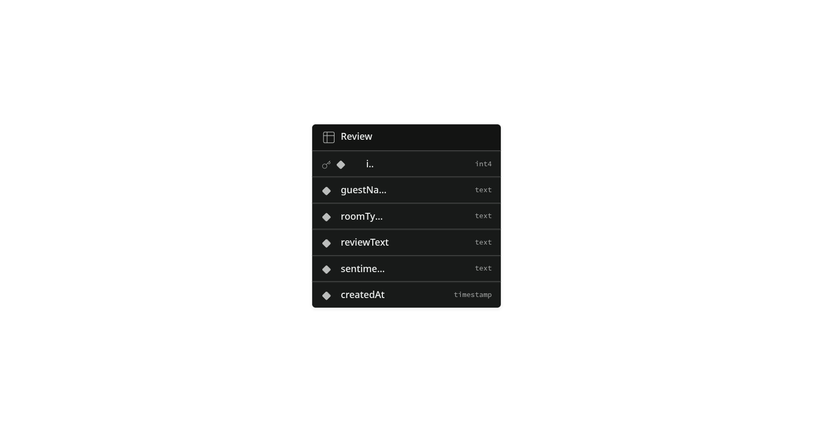

This is a [Next.js](https://nextjs.org) project bootstrapped with [`create-next-app`](https://github.com/vercel/next.js/tree/canary/packages/create-next-app).

## Getting Started

First, run the development server:

```bash
npm run dev
# or
yarn dev
# or
pnpm dev
# or
bun dev
```

Open [http://localhost:3000](http://localhost:3000) with your browser to see the result.

You can start editing the page by modifying `app/page.js`. The page auto-updates as you edit the file.

This project uses [`next/font`](https://nextjs.org/docs/app/building-your-application/optimizing/fonts) to automatically optimize and load [Geist](https://vercel.com/font), a new font family for Vercel.

## Learn More

To learn more about Next.js, take a look at the following resources:

- [Next.js Documentation](https://nextjs.org/docs) - learn about Next.js features and API.
- [Learn Next.js](https://nextjs.org/learn) - an interactive Next.js tutorial.

You can check out [the Next.js GitHub repository](https://github.com/vercel/next.js) - your feedback and contributions are welcome!

## Deploy on Vercel

The easiest way to deploy your Next.js app is to use the [Vercel Platform](https://vercel.com/new?utm_medium=default-template&filter=next.js&utm_source=create-next-app&utm_campaign=create-next-app-readme) from the creators of Next.js.

Check out our [Next.js deployment documentation](https://nextjs.org/docs/app/building-your-application/deploying) for more details.

## How to run the backend locally
1. `cd backend`
2. `npm install`
3. `npm run dev`

## Database Integration (Week 5)

The Express API is backed by a relational database accessed through the [Prisma](https://www.prisma.io/) ORM. The `Review` entity (guest name, room type, review text, sentiment, and a `createdAt` timestamp) is persisted in PostgreSQL and exposed via full CRUD routes at `/api/reviews`.

### Database Choice

**PostgreSQL, hosted on [Supabase](https://supabase.com/).** A relational database is a natural fit here because guest reviews are highly structured entities with a consistent, well-defined shape — every record shares the same typed columns, which keeps the data clean and easy to query, sort, and extend with relations later. Supabase's managed Postgres also provides a built-in **transaction pooler**, which keeps connections from the Express API stable and efficient (especially important when many short-lived API requests open and close connections).

### Database Setup

Another developer can point this project at their own database in three steps:

1. **Create a Supabase project** at [supabase.com](https://supabase.com/) and, from **Project Settings → Database**, copy the connection strings (both the pooled `DATABASE_URL` and the direct `DIRECT_URL`).
2. **Add the connection strings** to an environment file by copying `.env.example` and filling in the real values (the backend reads these from `backend/.env`):
   ```bash
   cp .env.example backend/.env
   # then edit backend/.env and paste your Supabase connection strings
   ```
3. **Generate the Prisma client** so the app can talk to the database:
   ```bash
   cd backend
   npx prisma generate
   ```

### Schema Diagram


